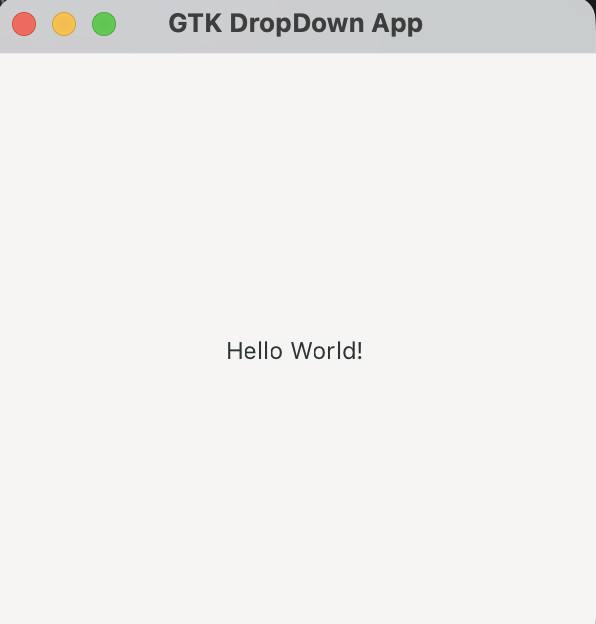
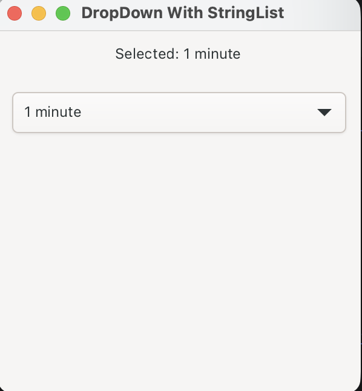
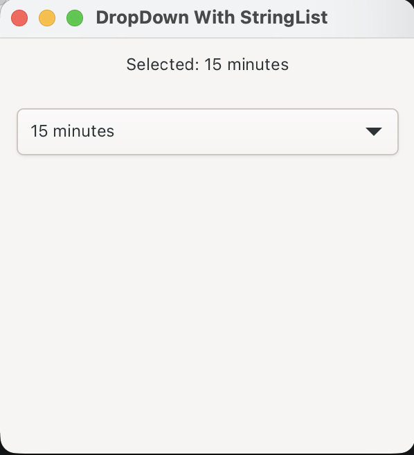
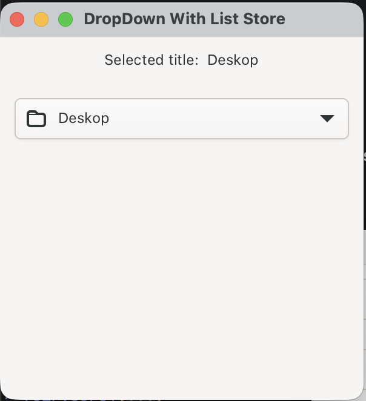

# Drop Down with GTK4 and .NET
## Project Setup
Let's start by installing/updating the `dotnet new` [GTK4 .NET Project Template] (https://github.com/kashif-code-samples/gtk4-dotnet-template).  

After making sure we have the new project template available in `dotnet new list`. We can proceed to create our project.  

Let's create a directory for the project and create project structure using following commands
```shell
mkdir gtk4-dotnet-drop-down
cd gtk4-dotnet-drop-down
dotnet new gtk4-app -p:n DropDown
```

Now we can run our application by executing:
```shell
dotnet run --project DropDown/DropDown.csproj
```
At this moment it would display a window with `Hello, world!`.
<figure>
  <a href="images/01-initial-window.png"></a>
  <figcaption>Hello World Window</figcaption>
</figure>

## Simple DropDown
Let's start with simple DropDown. First we need to add a referce of `GirCore.GObject-2.0.Integration` to our sample project. We need this to use `GObject.SubClass` attribute that would generate boilerplate code for our inherited window.  

Next lets add a class for our window.
```csharp
[GObject.Subclass<Gtk.ApplicationWindow>]
public partial class WithStringList
{
    partial void Initialize()
    {
        // initialize all members
    }
}
```

With our window class added, let's update `Program.cs` to show the new window. Only showing new code for brevity.
```csharp
application.OnActivate += (sender, args) =>
{
    var buttonShowWithStringList = CreateButton("With StringList");
    buttonShowWithStringList.OnClicked += (_, _) => new WithStringList().Show();
    ... 
    
    var gtkBox = Gtk.Box.New(Gtk.Orientation.Vertical, 0);
    gtkBox.Append(buttonShowWithStringList);
    
    ...
    
    window.Child = gtkBox;
}

static Gtk.Button CreateButton(string label)
{
    var button = Gtk.Button.New();
    button.Label = label;
    button.SetMarginTop(12);
    button.SetMarginBottom(12);
    button.SetMarginStart(12);
    button.SetMarginEnd(12);
    return button;
}
```

Next let's add and a label and a dropdown in `WithStringList`
```csharp
    private Gtk.Label _labelSelected;
    private Gtk.DropDown _dropDown;
```
And then update the `Initialize` method to initialize label and dropdown.
```csharp
    partial void Initialize()
    {
        Title = "DropDown With StringList";
        SetDefaultSize(300, 300);
        
        _labelSelected = Gtk.Label.New("Selected: 1 minute");
        _labelSelected.SetMarginTop(12);
        _labelSelected.SetMarginBottom(12);
        _labelSelected.SetMarginStart(12);
        _labelSelected.SetMarginEnd(12);

        var stringList = Gtk.StringList.New(["1 minute", "2 minutes", "5 minutes", "15 minutes", "30 minutes"]);
        _dropDown = new Gtk.DropDown();
        _dropDown.SetModel(stringList);
        _dropDown.SetSelected(0);
        _dropDown.SetMarginTop(12);
        _dropDown.SetMarginBottom(12);
        _dropDown.SetMarginStart(12);
        _dropDown.SetMarginEnd(12);
        
        _dropDown.OnNotify += (_, _) =>
        {
            var selectedItem = (Gtk.StringObject)_dropDown.SelectedItem!;
            var interval = selectedItem.GetString();
            _labelSelected.SetLabel($"Selected: {interval}");
        };
        
        var gtkBox = Gtk.Box.New(Gtk.Orientation.Vertical, 0);
        gtkBox.Append(_labelSelected);
        gtkBox.Append(_dropDown);

        Child = gtkBox;
    }
```
Here interesting part is that we create a `StringList` with the values that will be displayed in the DropDown. Then we set the model of DropDown to the created StringList. DropDown knows how to work with StringList. Finally we setup selected property changed handler of our DropDown and set the selected value in the label.

Following screenshots show the initial, dropdown and selection for simple DropDown.
<figure>
  <a href="images/03-string-list-initial.png"></a>
  <figcaption>With StringList Initial</figcaption>
</figure>

<figure>
  <a href="images/04-string-list-dropdown.png"></a>
  <figcaption>With StringList DropDown</figcaption>
</figure>

<figure>
  <a href="images/05-string-list-selected.png"></a>
  <figcaption>With StringList Selected</figcaption>
</figure>

## Complex DropDown
Let's go through with a complex example, where we display a Title, Description and an image. There will be another tickbox next to the selected item.

First let's add a custom object `StringHolder` to use in the model.
```csharp
[GObject.Subclass<GObject.Object>]
public partial class StringHolder
{
    public StringHolder(string title, string icon, string description) : this()
    {
        Title = title;
        Icon = icon;
        Description = description;
    }
    
    public string Title { get; }
    public string Icon { get; }
    public string Description { get; }
}
```

We would setup 2 `Gtk.SignalListItemFactory`, 1st to setup and bind drop down items and 2nd to setup list and bind dropdown items when item is selected.
```csharp
        var selectedFactory = Gtk.SignalListItemFactory.New();
        selectedFactory.OnSetup += OnSetupSelectedItem;
        selectedFactory.OnBind += OnBindSelectedItem;
        _dropDown.SetFactory(selectedFactory);
        
        // Factory for presenting the items in the dropdown list.
        var listFactory = Gtk.SignalListItemFactory.New();
        listFactory.OnSetup += OnSetupListItem;
        listFactory.OnBind += OnBindListItem;
        _dropDown.SetListFactory(listFactory);
```

Then we create the `Gio.ListStore` and set the dropdown's model.
```csharp
        ...
        CreateModel();
        _dropDown.SetModel(_listStore);
        _dropDown.SetSelected(0);
        ...

    private void CreateModel()
    {
        _listStore = Gio.ListStore.New(StringHolder.GetGType());
        _listStore.Append(new StringHolder("Deskop", "user-desktop-symbolic", "Deskop Folder"));
        _listStore.Append(new StringHolder("Home", "user-home-symbolic", "Home Folder"));
        _listStore.Append(new StringHolder("Trash", "user-trash-symbolic", "Trash Folder"));
        _listStore.Append(new StringHolder("Videos", "folder-videos-symbolic", "Videos Folder"));
    }
```

For selected item, we only display an `Image` and `Label` and display `Icon` and `Title` property from the model.
```csharp
    private static void OnSetupSelectedItem(Gtk.SignalListItemFactory factory, Gtk.SignalListItemFactory.SetupSignalArgs args)
    {
        var listItem = args.Object as Gtk.ListItem;
        var box = Gtk.Box.New(Gtk.Orientation.Horizontal, 10);
        box.Append(Gtk.Image.New());
        box.Append(Gtk.Label.New(""));
        listItem!.SetChild(box);
    }

    private static void OnBindSelectedItem(Gtk.SignalListItemFactory sender, Gtk.SignalListItemFactory.BindSignalArgs args)
    {
        var listItem = args.Object as Gtk.ListItem;
        var stringHolder = listItem!.GetItem() as StringHolder;
        if (stringHolder is null) return;
        
        var box = listItem.GetChild() as Gtk.Box;
        if (box is null) return;
        
        var image = box.GetFirstChild() as Gtk.Image;
        if (image is null) return;
        
        image.SetFromIconName(stringHolder.Icon);
        var label = image.GetNextSibling() as Gtk.Label;
        if (label is null) return;
        
        label.SetText(stringHolder.Title);
    }
```

For selected item however we also display `Description` and a tickbox image next to the selected item.
```csharp
    private static void OnSetupListItem(Gtk.SignalListItemFactory factory, Gtk.SignalListItemFactory.SetupSignalArgs args)
    {
        var listItem = args.Object as Gtk.ListItem;
        
        var hbox = Gtk.Box.New(Gtk.Orientation.Horizontal, 10);
        var vbox = Gtk.Box.New(Gtk.Orientation.Vertical, 2);
        
        hbox.Append(Gtk.Image.New());
        hbox.Append(vbox);
        
        var lblTitle = Gtk.Label.New("");
        lblTitle.SetXalign(0);
        vbox.Append(lblTitle);
        
        var lblDescription = Gtk.Label.New("");
        lblDescription.SetXalign(0);
        lblDescription.SetCssClasses(["dim-label"]);
        vbox.Append(lblDescription);

        var checkmark = Gtk.Image.New();
        checkmark.SetFromIconName("object-select-symbolic");
        checkmark.SetVisible(false);
        hbox.Append(checkmark);
        
        listItem!.SetChild(hbox);
    }

    private void OnBindListItem(Gtk.SignalListItemFactory sender, Gtk.SignalListItemFactory.BindSignalArgs args)
    {
        var listItem = args.Object as Gtk.ListItem;
        
        var stringHolder = listItem!.GetItem() as StringHolder;
        if (stringHolder is null) return;
        
        var hbox = listItem.GetChild() as Gtk.Box;
        if (hbox is null) return;
        
        var image = hbox.GetFirstChild() as Gtk.Image;
        image?.SetFromIconName(stringHolder.Icon);

        var vbox = image?.GetNextSibling() as Gtk.Box;
        if (vbox is null) return;
        
        var title = vbox.GetFirstChild() as Gtk.Label;
        title?.SetText(stringHolder.Title);
        var description = title?.GetNextSibling() as Gtk.Label;
        description?.SetText(stringHolder.Description);
        
        Gtk.DropDown.SelectedPropertyDefinition.Notify(_dropDown, (_, _) =>
        {
            OnSelectedItemChanged(listItem);
        });
        
        listItem.SetData("connection", IntPtr.Zero);
        OnSelectedItemChanged(listItem);
    }
```

Running the application will following

<figure>
  <a href="images/06-complex-dropdown.png"></a>
  <figcaption>Complex DropDown with ListStore</figcaption>
</figure>

<figure>
  <a href="images/07-complex-dropdown-selected.png"></a>
  <figcaption>Complex DropDown with ListStore Selected</figcaption>
</figure>

## Source
Source code for the demo application is hosted on GitHub in [gtk4-dotnet-drop-down](https://github.com/kashif-code-samples/gtk4-dotnet-drop-down) repository.

## References
In no particular order
* [GTK](https://www.gtk.org/)
* [GTK Installation](https://www.gtk.org/docs/installations/)
* [.NET](https://dotnet.microsoft.com/en-us/)
* [.NET Download](https://dotnet.microsoft.com/en-us/download)
* [GTK4 project template] (https://github.com/kashif-code-samples/gtk4-dotnet-template)
* [Gir.Core](https://github.com/gircore/gir.core)
* [Gir.Core Gtk-4.0 Samples](https://github.com/gircore/gir.core/tree/main/src/Samples/Gtk-4.0)
* [GTK DropDown](https://docs.gtk.org/gtk4/class.DropDown.html)
* [GTK4 DropDown Python Example](https://github.com/ksaadDE/GTK4PythonExamples/blob/main/DropDown.md)
* And many more
